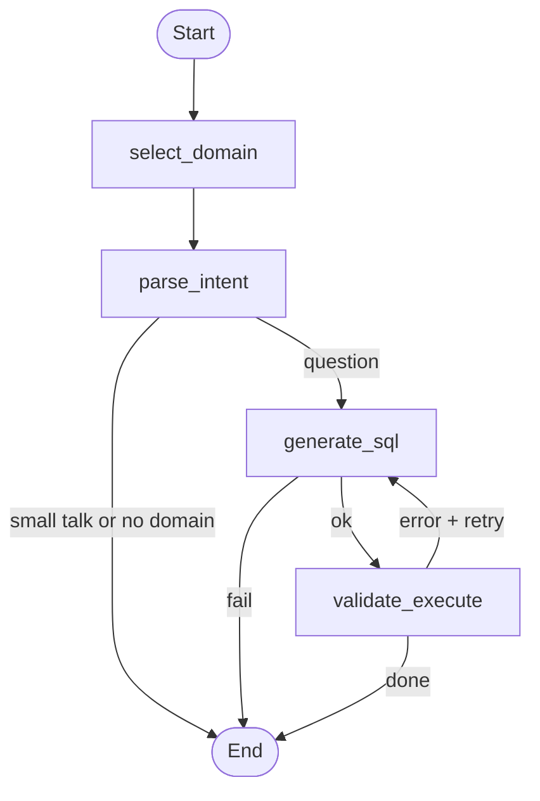

```mermaid
flowchart TD
	A([Start]) --> B[select_domain]
	B --> C[parse_intent]
	C -->|small talk or no domain| Z([End])
	C -->|question| D[generate_sql]
	D -->|fail| Z
	D -->|ok| E[validate_execute]
	E -->|error + retry| D
	E -->|done| Z
```