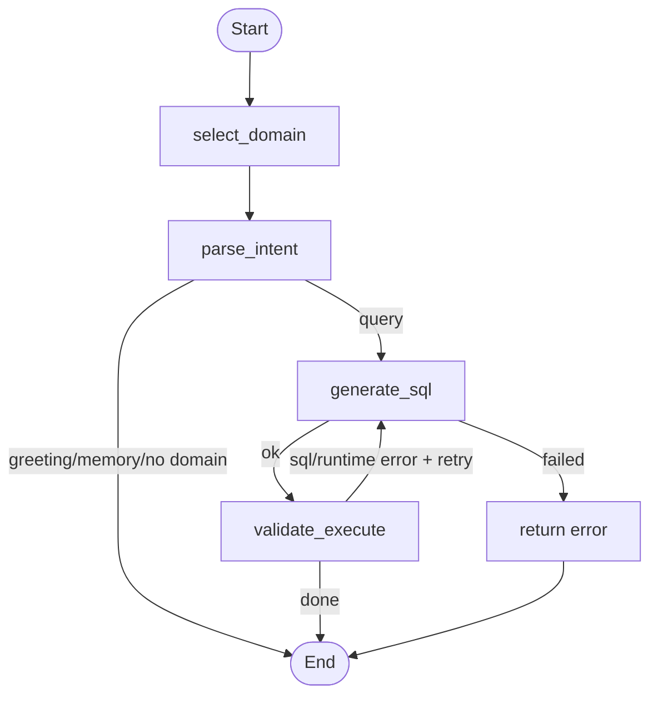

```mermaid
flowchart TD
	A([Start]) --> B[select_domain]
	B --> C[parse_intent]
	C -->|greeting/memory/no domain| Z([End])
	C -->|query| D[generate_sql]
	D -->|failed| F[return error]
	D -->|ok| E[validate_execute]
	E -->|sql/runtime error + retry| D
	E -->|done| Z
	F --> Z
```