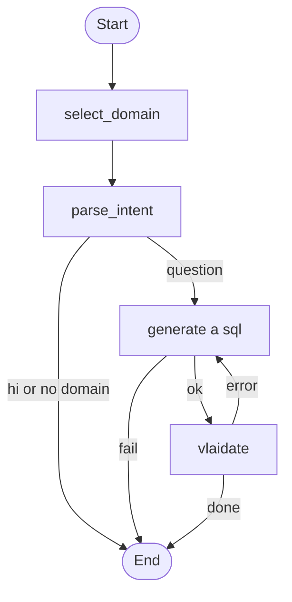

```mermaid
flowchart TD
    A([Start]) --> B[select_domain]
    B --> C[parse_intent]
    C -->|hi or no domain| Z([End])
    C -->|question| D[generate a sql]
    D -->|fail| Z
    D -->|ok| E[vlaidate]
    E -->|error| D
    E -->|done| Z
```